# 🏥 Lab Integrador U3 - Medical Diagnosis Classification

[](https://www.python.org/)
[](https://www.tensorflow.org/)
[](https://scikit-learn.org/)
[](https://mlflow.org/)
[](LICENSE)
[]()

> Laboratorio Integrador Profesional de Minería de Datos enfocado en clasificación médica con stack completo de MLOps.

---

## 📋 Tabla de Contenidos

- [Descripción](#-descripción)
- [Características Principales](#-características-principales)
- [Stack Tecnológico](#-stack-tecnológico)
- [Objetivos de Aprendizaje](#-objetivos-de-aprendizaje)
- [Estructura del Proyecto](#-estructura-del-proyecto)
- [Instalación](#-instalación)
- [Uso](#-uso)
- [Pipeline MLOps](#-pipeline-mlops)
- [Modelos Implementados](#-modelos-implementados)
- [Resultados](#-resultados)
- [Herramientas Profesionales](#-herramientas-profesionales)
- [Contribución](#-contribución)
- [Licencia](#-licencia)
- [Autor](#-autor)

---

## 🎯 Descripción

Laboratorio integrador de nivel profesional que implementa un pipeline completo de Machine Learning para diagnóstico de enfermedades cardíacas utilizando el dataset **UCI Heart Disease**. El proyecto cubre todo el ciclo de vida de ML: desde EDA exhaustivo hasta deployment-ready models con interpretabilidad completa.

### 🏆 Destacados

- ✅ **5 modelos de ML** entrenados y comparados
- ✅ **Stack MLOps completo** (MLflow, Optuna, SHAP, Evidently)
- ✅ **Optimización automática** de hiperparámetros
- ✅ **Interpretabilidad** con 6 tipos de visualizaciones SHAP
- ✅ **Validación exhaustiva** con Deepchecks (30+ checks)
- ✅ **Reportes automáticos** profesionales
- ✅ **Código reproducible** con seeds y versionado

---

## ✨ Características Principales

### 📊 Análisis Exploratorio de Datos (EDA)

- Análisis univariado y bivariado completo
- Detección y análisis de outliers
- Visualizaciones profesionales con Yellowbrick
- Análisis clínico específico por grupos de edad
- Reducción dimensional (PCA, t-SNE, UMAP)

### 🤖 Machine Learning Pipeline

- **Preprocesamiento robusto** sin data leakage
- **5 modelos implementados:**
  1. Logistic Regression (baseline)
  2. Random Forest (optimizado)
  3. XGBoost (optimizado)
  4. Neural Network (Deep Learning)
  5. Ensemble (Voting Classifier)
  
### 🔧 Optimización de Hiperparámetros

- **Optuna** para búsqueda automática (60 trials total)
- Visualización del proceso de optimización
- Logging automático en MLflow
- Estrategias adaptativas según modelo

### 📈 MLOps & Tracking

- **MLflow** para experiment tracking
- Registro automático de:
  - Parámetros
  - Métricas
  - Modelos
  - Artifacts
- UI interactiva vía ngrok

### 🔍 Interpretabilidad

- **SHAP Analysis** exhaustivo:
  - Summary plots (global importance)
  - Dependence plots (feature interactions)
  - Waterfall plots (individual predictions)
  - Force plots (multiple cases)
  - Decision plots (prediction trajectories)
- Análisis de coherencia clínica

### ✅ Validación & Monitoring

- **Deepchecks** full suite (30+ validaciones)
- **Evidently AI** para reportes de clasificación
- Análisis de calibración de probabilidades
- Cross-validation estratificada

---

## 🛠️ Stack Tecnológico

### Core ML/DL


### MLOps & Tracking


### Visualización & Análisis


### Interpretabilidad & Validación

| Herramienta | Propósito | Nivel de Uso |
|-------------|-----------|--------------|
| **SHAP** | Explicabilidad de modelos | ⭐⭐⭐⭐⭐ |
| **Yellowbrick** | Visualización de diagnóstico | ⭐⭐⭐⭐ |
| **Evidently AI** | Reportes automáticos | ⭐⭐⭐⭐ |
| **Deepchecks** | Validación de modelos | ⭐⭐⭐⭐ |

### Desarrollo


---

## 🎓 Objetivos de Aprendizaje

Al completar este laboratorio, los estudiantes serán capaces de:

1. ✅ Realizar análisis exploratorio exhaustivo (EDA) de datos médicos
2. ✅ Implementar preprocesamiento profesional evitando data leakage
3. ✅ Entrenar y optimizar múltiples modelos de ML (baseline → avanzados)
4. ✅ Usar **Optuna** para optimización automática de hiperparámetros
5. ✅ Registrar experimentos con **MLflow** para reproducibilidad
6. ✅ Generar visualizaciones profesionales con **Yellowbrick**
7. ✅ Crear reportes automáticos con **Evidently AI**
8. ✅ Interpretar modelos usando **SHAP** (explicabilidad)
9. ✅ Validar modelos con **Deepchecks** antes de deployment
10. ✅ Seleccionar modelos usando métricas compuestas apropiadas

---

## 📁 Estructura del Proyecto

```
Lab_Integrador_U3/
│
├── 📓 Lab_Integrador_U3_Medical_Diagnosis.ipynb    # Notebook principal
│
├── 📊 outputs/                                      # Artefactos generados
│   ├── model_comparison_results.csv
│   ├── shap_statistics.csv
│   ├── evidently_classification_report.html
│   ├── deepchecks_validation_report.html
│   └── *.png                                       # Visualizaciones
│
├── 🗂️ mlruns/                                      # Experimentos MLflow
│   ├── 0/                                          # Experiment ID
│   │   ├── meta.yaml
│   │   └── [run_ids]/
│   └── models/                                     # Modelos registrados
│
├── 🏆 best_model_*.pkl                             # Mejor modelo guardado
│
├── 📄 README.md                                    # Este archivo
├── 📋 CHANGELOG.md                                 # Historial de versiones
├── 📜 LICENSE                                      # Licencia MIT
└── 📝 requirements.txt                             # Dependencias
```

---

## 🚀 Instalación

### Opción 1: Google Colab (Recomendado)

```python
# 1. Subir notebook a Google Colab
# 2. Ejecutar celda de instalación (ya incluida):

!pip install -q optuna mlflow yellowbrick evidently shap deepchecks xgboost imbalanced-learn pyngrok
```

⏱️ Tiempo de instalación: 2-3 minutos

### Opción 2: Entorno Local

```bash
# 1. Clonar repositorio
git clone https://github.com/tuusuario/lab-integrador-u3.git
cd lab-integrador-u3

# 2. Crear entorno virtual
python -m venv venv
source venv/bin/activate  # Linux/Mac
# o
venv\Scripts\activate      # Windows

# 3. Instalar dependencias
pip install -r requirements.txt

# 4. Iniciar Jupyter
jupyter notebook Lab_Integrador_U3_Medical_Diagnosis.ipynb
```

### Requisitos del Sistema

- **Python**: 3.8 o superior
- **RAM**: 8GB mínimo (16GB recomendado)
- **Espacio**: 2GB disponibles
- **GPU**: Opcional (acelera Neural Network)

---

## 💻 Uso

### Ejecución Completa

```python
# En Google Colab o Jupyter:

# 1. Ejecutar celda de instalación
# 2. Ejecutar todas las celdas: Runtime > Run all
# 3. Esperar 15-25 minutos (depende del hardware)
# 4. Acceder a MLflow UI con el link ngrok generado
```

### Ejecución por Fases

El notebook está dividido en 16 fases modulares:

1. **FASE 1-2**: Setup e imports
2. **FASE 3**: Configuración MLflow + ngrok
3. **FASE 4**: Carga de datos
4. **FASE 5**: EDA exhaustivo (9 subfases)
5. **FASE 6**: Preprocesamiento
6. **FASE 7-11**: Entrenamiento de 5 modelos
7. **FASE 12**: Selección del mejor modelo
8. **FASE 13**: SHAP Analysis
9. **FASE 14**: Validación con Deepchecks
10. **FASE 15**: (Opcional) Evidently AI
11. **FASE 16**: Resumen ejecutivo

### Outputs Generados

Después de ejecutar el notebook completo:

```
outputs/
├── 📊 model_comparison_final.png              # Comparación visual
├── 📈 shap_1_summary_beeswarm.png            # SHAP global
├── 📈 shap_2_importance_bar.png              # Feature ranking
├── 📈 shap_3_dependence_plots.png            # Interacciones
├── 📈 shap_4_waterfall_plots.png             # Explicaciones individuales
├── 📈 shap_5_force_plot.png                  # Múltiples casos
├── 📈 shap_6_decision_plot.png               # Trayectorias
├── 📊 shap_statistics.csv                     # Estadísticas SHAP
├── 📋 model_comparison_results.csv            # Resultados finales
├── 📄 evidently_classification_report.html    # Reporte Evidently
├── 📄 deepchecks_validation_report.html       # Validación completa
└── 📝 resumen_ejecutivo.md                    # Resumen Markdown
```

---

## 🔄 Pipeline MLOps

### Workflow Completo

```mermaid
graph LR
    A[📊 Raw Data] --> B[🔍 EDA]
    B --> C[⚙️ Preprocessing]
    C --> D[🤖 Model Training]
    D --> E[🎯 HPO Optuna]
    E --> F[📈 MLflow Tracking]
    F --> G[🔍 SHAP Analysis]
    G --> H[✅ Deepchecks Validation]
    H --> I[📊 Evidently Reports]
    I --> J[🏆 Best Model Selection]
    J --> K[💾 Model Registry]
    K --> L[🚀 Deployment Ready]
```



### Características MLOps

#### 1. **Experiment Tracking (MLflow)**

- ✅ Tracking automático de experimentos
- ✅ Registro de parámetros, métricas y artifacts
- ✅ Versionado de modelos
- ✅ UI interactiva para comparación
- ✅ Model registry integrado

#### 2. **Hyperparameter Optimization (Optuna)**

- ✅ Búsqueda automática de hiperparámetros
- ✅ 60 trials total (20 por modelo optimizado)
- ✅ Pruning automático de trials no prometedores
- ✅ Visualización de optimization history
- ✅ Integración con MLflow

#### 3. **Model Interpretability (SHAP)**

- ✅ 6 tipos de visualizaciones
- ✅ Análisis global y local
- ✅ Feature interactions
- ✅ Validación clínica de features
- ✅ Exportable para stakeholders

#### 4. **Model Validation (Deepchecks)**

- ✅ 30+ validaciones automáticas
- ✅ Data integrity checks
- ✅ Train-test validation
- ✅ Model performance checks
- ✅ Reporte HTML interactivo

#### 5. **Monitoring (Evidently AI)**

- ✅ Reportes de clasificación
- ✅ Análisis de performance
- ✅ Detección de drift
- ✅ Métricas por clase
- ✅ Visualizaciones interactivas

---

## 🤖 Modelos Implementados

### 1. Logistic Regression (Baseline)

**Configuración:**
```python
LogisticRegression(
    random_state=42,
    max_iter=1000,
    solver='lbfgs'
)
```

**Propósito:** Establecer baseline simple e interpretable.

**Resultados Típicos:**
- Accuracy: ~86-87%
- F1-Score: ~86-87%
- ROC-AUC: ~95%

---

### 2. Random Forest (Optimizado con Optuna)

**Espacio de Búsqueda:**
```python
{
    'n_estimators': [50, 300],
    'max_depth': [3, 20],
    'min_samples_split': [2, 20],
    'min_samples_leaf': [1, 10]
}
```

**Trials:** 20  
**Tiempo:** ~3-5 minutos

**Resultados Típicos:**
- Accuracy: ~91-92%
- F1-Score: ~91-92%
- ROC-AUC: ~96-97%

---

### 3. XGBoost (Optimizado con Optuna)

**Espacio de Búsqueda:**
```python
{
    'n_estimators': [50, 300],
    'max_depth': [3, 8],
    'learning_rate': [0.01, 0.3],
    'subsample': [0.6, 1.0],
    'colsample_bytree': [0.6, 1.0],
    'gamma': [0, 0.5],
    'reg_alpha': [0, 1.0],
    'reg_lambda': [0, 1.0]
}
```

**Trials:** 20  
**Tiempo:** ~3-5 minutos

**Resultados Típicos:**
- Accuracy: ~90-91%
- F1-Score: ~90%
- ROC-AUC: ~95%

---

### 4. Neural Network (Deep Learning)

**Arquitectura:**
```python
Sequential([
    Dense(24, activation='relu'),
    BatchNormalization(),
    Dropout(0.3),
    Dense(16, activation='relu'),
    BatchNormalization(),
    Dropout(0.3),
    Dense(8, activation='relu'),
    Dropout(0.15),
    Dense(1, activation='sigmoid')
])
```

**Training:**
- Optimizer: Adam
- Loss: Binary Crossentropy
- Early Stopping: patience=15
- Learning Rate Reduction

**Resultados Típicos:**
- Accuracy: ~88-89%
- F1-Score: ~87-88%
- ROC-AUC: ~90-91%

---

### 5. Ensemble (Voting Classifier)

**Configuración:**
```python
VotingClassifier(
    estimators=[
        ('lr', logistic_regression),
        ('rf', random_forest),
        ('xgb', xgboost)
    ],
    voting='soft'  # Promedia probabilidades
)
```

**Resultados Típicos:**
- Accuracy: ~90-91%
- F1-Score: ~89-90%
- ROC-AUC: ~96%

---

## 📊 Resultados

### Comparación de Modelos (Ejemplo)

| Modelo | Train Acc | Test Acc | F1-Score | ROC-AUC | Train-Test Gap |
|--------|-----------|----------|----------|---------|----------------|
| Logistic Regression | 0.851 | 0.869 | 0.867 | 0.951 | -0.018 |
| **Random Forest** | **0.860** | **0.918** | **0.912** | **0.965** | **-0.058** |
| XGBoost | 0.988 | 0.902 | 0.900 | 0.950 | 0.086 |
| Neural Network | 0.847 | 0.885 | 0.877 | 0.905 | -0.038 |
| Ensemble | 0.913 | 0.902 | 0.897 | 0.962 | 0.012 |

### Selección del Mejor Modelo

**Criterio: Composite Score**
```
Score = 0.4 × AUC + 0.4 × F1 + 0.2 × Accuracy
```

**Por qué esta fórmula:**
- **AUC (40%):** Capacidad de discriminación (crítico en medicina)
- **F1 (40%):** Balance precisión-recall (evita falsos negativos)
- **Accuracy (20%):** Desempeño general

**Penalización:** Si Train-Test Gap > 5%, se aplica penalización por overfitting.

### Top Features según SHAP

Típicamente los 3 features más importantes son:

1. **ca** (número de vasos principales): Indicador directo de enfermedad
2. **cp** (tipo de dolor de pecho): Síntoma primario
3. **thalach** (frecuencia cardíaca máxima): Capacidad cardíaca

---

## 🔨 Herramientas Profesionales

### MLflow

**Uso:**
```python
import mlflow

# Iniciar experimento
mlflow.set_experiment("medical_diagnosis")

# Logging automático
with mlflow.start_run():
    mlflow.log_params(params)
    mlflow.log_metrics(metrics)
    mlflow.sklearn.log_model(model, "model")
```

**Beneficios:**
- Tracking de experimentos
- Comparación de runs
- Versionado de modelos
- UI interactiva

---

### Optuna

**Uso:**
```python
import optuna

def objective(trial):
    # Definir espacio de búsqueda
    params = {
        'n_estimators': trial.suggest_int('n_estimators', 50, 300),
        'max_depth': trial.suggest_int('max_depth', 3, 20)
    }
    
    # Entrenar y evaluar
    model = RandomForestClassifier(**params)
    score = cross_val_score(model, X, y, cv=5).mean()
    return score

# Optimizar
study = optuna.create_study(direction='maximize')
study.optimize(objective, n_trials=20)
```

**Beneficios:**
- Optimización automática
- Pruning inteligente
- Visualización del proceso
- Integración con MLflow

---

### SHAP

**Uso:**
```python
import shap

# Crear explainer
explainer = shap.TreeExplainer(model)

# Calcular SHAP values
shap_values = explainer.shap_values(X_test)

# Visualizar
shap.summary_plot(shap_values, X_test)
shap.waterfall_plot(shap_values[0])
```

**Beneficios:**
- Explicabilidad completa
- Análisis global y local
- Feature interactions
- Visualizaciones profesionales

---

### Yellowbrick

**Uso:**
```python
from yellowbrick.classifier import ClassificationReport, ROCAUC

# Classification report
visualizer = ClassificationReport(model)
visualizer.fit(X_train, y_train)
visualizer.score(X_test, y_test)
visualizer.show()

# ROC-AUC curves
visualizer = ROCAUC(model)
visualizer.fit(X_train, y_train)
visualizer.score(X_test, y_test)
visualizer.show()
```

**Beneficios:**
- Visualizaciones instantáneas
- Diagnóstico rápido
- Profesional out-of-the-box

---

### Evidently AI

**Uso:**
```python
from evidently.report import Report
from evidently.metric_preset import ClassificationPreset

# Crear reporte
report = Report(metrics=[ClassificationPreset()])
report.run(reference_data=train_df, current_data=test_df)
report.save_html('classification_report.html')
```

**Beneficios:**
- Reportes automáticos
- Análisis exhaustivo
- Detección de drift
- HTML interactivo

---

### Deepchecks

**Uso:**
```python
from deepchecks.tabular.suites import full_suite
from deepchecks.tabular import Dataset

# Crear datasets
train_ds = Dataset(X_train, label=y_train, cat_features=categorical)
test_ds = Dataset(X_test, label=y_test, cat_features=categorical)

# Ejecutar suite
suite = full_suite()
result = suite.run(train_dataset=train_ds, test_dataset=test_ds, model=model)
result.save_as_html('validation_report.html')
```

**Beneficios:**
- 30+ validaciones
- Data integrity
- Model performance
- Reporte profesional

---

## 🤝 Contribución

¡Las contribuciones son bienvenidas!

### Cómo Contribuir

1. Fork el proyecto
2. Crea tu feature branch (`git checkout -b feature/AmazingFeature`)
3. Commit tus cambios (`git commit -m 'Add some AmazingFeature'`)
4. Push al branch (`git push origin feature/AmazingFeature`)
5. Abre un Pull Request

### Áreas de Mejora

- [ ] Agregar más modelos (LightGBM, CatBoost)
- [ ] Implementar cross-validation estratificada
- [ ] Agregar análisis de calibración
- [ ] Desarrollar API REST con FastAPI
- [ ] Containerización con Docker
- [ ] CI/CD con GitHub Actions
- [ ] Deployment en cloud (AWS/GCP/Azure)

---

## 📜 Licencia

Este proyecto está bajo la Licencia MIT. Ver archivo [LICENSE](LICENSE) para más detalles.

```
MIT License

Copyright (c) 2025 Eduardo Farías Reyes

Permission is hereby granted, free of charge, to any person obtaining a copy
of this software and associated documentation files (the "Software"), to deal
in the Software without restriction, including without limitation the rights
to use, copy, modify, merge, publish, distribute, sublicense, and/or sell
copies of the Software, and to permit persons to whom the Software is
furnished to do so, subject to the following conditions:

The above copyright notice and this permission notice shall be included in all
copies or substantial portions of the Software.

THE SOFTWARE IS PROVIDED "AS IS", WITHOUT WARRANTY OF ANY KIND, EXPRESS OR
IMPLIED, INCLUDING BUT NOT LIMITED TO THE WARRANTIES OF MERCHANTABILITY,
FITNESS FOR A PARTICULAR PURPOSE AND NONINFRINGEMENT. IN NO EVENT SHALL THE
AUTHORS OR COPYRIGHT HOLDERS BE LIABLE FOR ANY CLAIM, DAMAGES OR OTHER
LIABILITY, WHETHER IN AN ACTION OF CONTRACT, TORT OR OTHERWISE, ARISING FROM,
OUT OF OR IN CONNECTION WITH THE SOFTWARE OR THE USE OR OTHER DEALINGS IN THE
SOFTWARE.
```

---

## 👨‍🏫 Autor

**Eduardo Farías Reyes**  
Profesor de Minería de Datos  
Instituto Profesional Santo Tomás - Arica, Chile

**Contacto:**
- 📧 Email: [efarias4@santotomas.cl]
- 💼 LinkedIn: [[efarias](https://www.linkedin.com/in/efariasr/)]
- 🐙 GitHub: [@efarias](https://github.com/efarias)

---

## 🎓 Contexto Académico

**Curso:** Minería de Datos (IEI-097)  
**Institución:** Instituto Profesional Santo Tomás  
**Nivel:** 6º Semestre - Ingeniería en Informática  
**Año:** 2025

### Objetivos del Curso

Este laboratorio integrador forma parte del curso de Minería de Datos y busca:

1. ✅ Aplicar técnicas avanzadas de ML en problemas reales
2. ✅ Familiarizar estudiantes con herramientas profesionales
3. ✅ Desarrollar habilidades en MLOps
4. ✅ Fomentar buenas prácticas de desarrollo
5. ✅ Preparar para roles en la industria

---

## 🙏 Agradecimientos

- **UCI Machine Learning Repository** por el dataset Heart Disease
- **Anthropic** por Claude (asistencia en desarrollo)
- **Comunidad Open Source** por las increíbles herramientas
- **Estudiantes de IEI-097** por feedback continuo

---

## 📚 Referencias

1. **Dataset:** [UCI Heart Disease](https://archive.ics.uci.edu/ml/datasets/heart+disease)
2. **MLflow:** [https://mlflow.org/docs/latest/](https://mlflow.org/docs/latest/)
3. **Optuna:** [https://optuna.readthedocs.io/](https://optuna.readthedocs.io/)
4. **SHAP:** [https://shap.readthedocs.io/](https://shap.readthedocs.io/)
5. **Evidently:** [https://docs.evidentlyai.com/](https://docs.evidentlyai.com/)
6. **Deepchecks:** [https://docs.deepchecks.com/](https://docs.deepchecks.com/)

---

## 🏆 Logros

- ✅ **5 modelos** entrenados y comparados
- ✅ **60 trials** de optimización Optuna
- ✅ **6 visualizaciones** SHAP generadas
- ✅ **30+ validaciones** Deepchecks ejecutadas
- ✅ **100% reproducible** con seeds y MLflow
- ✅ **Nivel industria** en herramientas y prácticas

---

<div align="center">

### ⭐ Si este proyecto te fue útil, considera darle una estrella en GitHub ⭐

**Desarrollado con ❤️ para la comunidad de Data Science**

</div>

---

**Última actualización:** 17 de Noviembre de 2025  
**Versión:** 3.4.0
